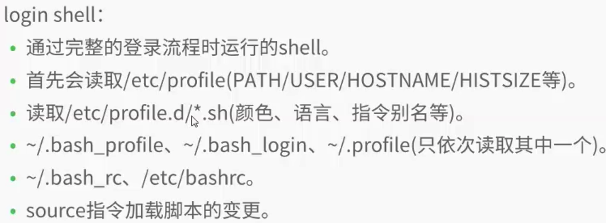
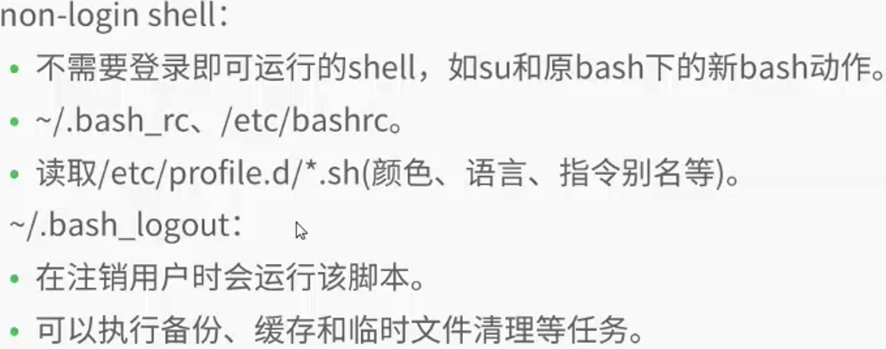

## Shell

### 前言：shell基础
1. 记录历史命令，`.bash_history`
	* !! 上一条命令
	* !n 历史第n条命令
	* !xx 历史上以xx开头的命令
2. tab补齐指令和文件名
3. alias别名设置
4. >> << 重定向
5. |管道
7. 环境变量（个人/系统）
	* .bash_profile：定义了用户的个人化路径与环境变量的文件名称。每个用户都可使用该文件输入专用于自己使用的shell信息,当用户登录时,该文件仅仅执行一次。
	* .bashrc：该文件包含专用于你的shell的bash信息,当登录时以及每次打开新的shell时,该该文件被读取。例如你可以将用户自定义的alias或者自定义变量写到这个文件中。
	* .bash_history：记录命令历史用的。
	* .bash_logout ：当退出shell时，会执行该文件。可以把一些清理的工作放到这个文件中。
8. Clear, ctrl+k 清除屏幕里面的所有命令 
9. pwd 显示当前目录路径


#### 正则表达式
3. ^: 匹配行首位置
3. $: 匹配行尾位置
3. : 匹配任意祖父
3. : 对 之前的匹配整体或字符匹配任意次 (包括 0 次)
3. \?: 对 \? 之前的匹配整体或字符匹配 0 次或 1 次
3. {n}: 对 \ { 之前的匹配整体或字符匹配 n 次
3. {m,}: 对 \ { 之前的匹配整体或字符匹配至少 m 次
3. {m,n}: 对 \ { 之前的匹配整体或字符匹配 m 到 n 次
3. [abcdef]: 对单字符而言匹配 [] 中的字符
3. [a-z]; 对单字符而言，匹配任意一个小写字母

#### Shell startup scripts 




### 1 File Command
1. ls 显示文件基本信息
	* ls -a，列出包括以．号开头的隐藏文件 / 文件夹（也就是所有文件）
	* ls -R，显示出目录下以及其所有子目录的文件 / 文件夹（递归地方式，不显示隐藏的文件）
	* ls -a -R，显示出目录下以及其所有子目录的文件 / 文件夹（递归地方式，显示隐藏的文件）
	* ls -l，列出目录下所有文件的权限、所有者、文件大小、修改时间及名称（也就是显示详细信息，不显示隐藏文件）。显示出来的效果如下：
		
		```
		-rwxr-xr-x. 1 root root 4096 3月 26 10:57，最前面的 - 表示这是一个普通文件
		lrwxrwxrwx. 1 root root 4096 3月 26 10:57，最前面的 l 表示这是一个链接文件，类似 Windows 的快捷方式
		drwxr-xr-x. 5 root root 4096 3月 26 10:57，最前面的 d 表示这是一个目录
		```

	* ls -ld 目录名，显示该目录的基本信息
	* ls -t，依照文件最后修改时间的顺序列出文件名。
	* ls -F，列出当前目录下的文件名及其类型。以 / 结尾表示为目录名，以 * 结尾表示为可执行文件，以 @ 结尾表示为符号连接
	* ls -lg，同上，并显示出文件的所有者工作组名。
	* ls -lh，查看文件夹类文件详细信息，文件大小，文件修改时间
	* ls /opt | head -5，显示 opt 目录下前5条记录
	* ls -l /opt |grep "^-"|wc -l，统计 opt 目录下文件的个数，不会递归统计
	* ls -lR /opt |grep "^-"|wc -l，统计 opt 目录下文件的个数，会递归统计
	* ls -l /opt |grep "^d"|wc -l，统计 opt 目录下目录的个数，不会递归统计
	* ls -lR /opt |grep "^d"|wc -l，统计 opt 目录下目录的个数，会递归统计
	* ls -lR /opt |grep "js"|wc -l，统计 opt 目录下 js 文件的个数，会递归统计
	
2. cd 目录切换
	* cd ..，改变目录位置至当前目录的父目录(上级目录)。
	* cd ~，改变目录位置至用户登录时的工作目录。
	* cd 回车，回到家目录
	* cd -，上一个工作目录
	* cd dir1/，改变目录位置至 dir1 目录下。
	* cd ~user，改变目录位置至用户的工作目录。
	* cd ../user，改变目录位置至相对路径user的目录下。
	* cd /../..，改变目录位置至绝对路径的目录位置下。

3. 显示文件内容
	* echo 
	* cat [-n] fileName
	* more/less fileName
	* head/tail [-n|-f] fileName

4. chmod 777|u+x file 
	* linux 的权限分为 rwx，这三个权限都可以转换成数值表示，r = 4，w = 2，x = 1，- = 0，所以总和是 7，也就是最大权限。
	* 第一个 7 是所属主（user）的权限，第二个 7 是所属组（group）的权限，最后一位 7 是非本群组用户（others）的权限。
	* 脚本可执行需要添加执行权限`chmod u+x test.sh`

 
### 2 查找
1. find
	* find . -name *lin*，其中 . 代表在当前目录找，-name 表示匹配文件名 / 文件夹名，*lin* 用通配符搜索含有lin的文件或是文件夹
	* find . -iname *lin*，其中 . 代表在当前目录找，-iname 表示匹配文件名 / 文件夹名（忽略大小写差异），*lin* 用通配符搜索含有lin的文件或是文件夹
	* find / -name *.conf，其中 / 代表根目录查找，*.conf代表搜索后缀会.conf的文件
	* find /opt -name .oh-my-zsh，其中 /opt 代表目录名，.oh-my-zsh 代表搜索的是隐藏文件 / 文件夹名字为 oh-my-zsh 的
	* find /opt -type f -iname .oh-my-zsh，其中 /opt 代表目录名，-type f 代表只找文件，.oh-my-zsh 代表搜索的是隐藏文件名字为 oh-my-zsh 的
	* find /opt -type d -iname .oh-my-zsh，其中 /opt 代表目录名，-type d 代表只找目录，.oh-my-zsh 代表搜索的是隐藏文件夹名字为 oh-my-zsh 的
	* find . -name "lin*" -execls -l{}\;，当前目录搜索lin开头的文件，然后用其搜索后的结果集，再执行ls -l的命令（这个命令可变，其他命令也可以），其中 -exec 和 {}\; 都是固定格式

2. `grep [-cinvABC] "word" filename`
	* -c ：打印符合要求的行数
	* -i ：忽略大小写
	* -n ：在输出符合要求的行的同时连同行号一起输出
	* -v ：打印不符合要求的行
	* -A ：后跟一个数字（有无空格都可以），例如 –A2则表示打印符合要求的行以及下面两行
	* -B ：后跟一个数字，例如 –B2 则表示打印符合要求的行以及上面两行
	* -C ：后跟一个数字，例如 –C2 则表示打印符合要求的行以及上下各两行
	* grep pattern files 		--search for pattern in files 
	* grep -r pattern dir 	--search recursively for pattern in dir
	* grep -i pattern dir 	--大小写不敏感
	* set| grep pattern		--在环境变量中过滤pattern
	* command | grep pattern --search for pattern in the output of command


3. sed

4. awk


### 3 系统/进程管理
* ps 当前运行的进程
* top 所有运行的进程
* 杀进程
	* fg(Ctrl+z)/bg(Ctrl+c)暂停/终止进程——作业控制
	* kill pid 	--kill process id pid
	* killall proc  --kill all process baned proc (use with extrme caution)
	* bg --lised stopped or background jobs, resume a stopped job in the background
	* fg -brings the most recent job to foreground
	* fg n --brings job n to the foreground 
* df -h，查看磁盘大小和使用空间，df , free
* du
	* du -sh /opt，查看 opt 这个文件夹大小 （h 的意思 human-readable 用人类可读性较好方式显示，系统会自动调节单位，显示合适大小的单位）
	* du -sh ./*，查看当前目录下所有文件夹大小 （h 的意思 human-readable 用人类可读性较好方式显示，系统会自动调节单位，显示合适大小的单位）
* cat /etc/resolv.conf，查看 DNS 设置
* jobs 查看后台运行的程序列表
* ifconfig 查看IP信息
* sudo command 使用管理员权限
* 关于时间，日期
	* date 查看系统时间
	* date -s20000101 设置日期
	* date -s00:00 设置时间。如要修改BIOS时间，再执行一次 hwclock --systohc
	* cal 查看日历
* poweroff 关机， reboot 重启
* shutdown 
	* shutdown -hnow，立即关机
	* shutdown -h+10，10分钟后关机
	* shutdown -h23:30，23:30关机
	* shutdown -rnew，立即重启
* exit 注销
* last 最近登录的帐户及时间
* lastlog 显示系统所有用户各自在最近登录的记录，如果没有登录过的用户会显示 从未登陆过
* uptime 查看系统运行多久，当前有几个用户等信息
  
 
### 4 shell组合键
* Ctrl+Z 	 --stops the current command , resume with fg in the forefround or bg in the background
* !! (!num)
* Clear	  --清屏  
* Ctrl-A	光标到行首
* Ctrl-E	光标到行尾
* Ctrl-F	前移一个字符，等价于右箭头
* Ctrl-B	后移一个字符，等价于左箭头
* Ctrl-K	剪切从光标到行尾
* Ctrl-U	剪切从光标到行首
* Ctrl-Y	粘贴
* Ctrl-P	移动到前一条历史记录，等于上箭头
* Ctrl-N	移动到后一条历史记录，等于下箭头
* Ctrl-O	执行历史记录项，执行完后跳到下一项。用于执行一系列历史记录
* Ctrl-R	逆向递增搜索历史记录；搜索时查找下一个匹配项
* Ctrl-J	把搜索内容复制到当前命令行（按左右方向键也能复制，若按Enter会立即执行命令）
* Ctrl-G或C	退出
* Ctrl-W	删除字符串
* Ctrl-H	删除光标前一个字符
* Ctrl-D	删除光标后一个字符

* Alt<—	移动到历史记录开始处
* Alt->	移动到历史记录末尾处，即当前命令行
* Alt-P	非递增搜索。输入搜索串后键入Enter才开始搜索
* Alt-N	向前非递增搜索


### 5 network
* netstat -i 查看网卡
* netstat -r	查看路由
* netstat -tulpn 显示侦听的端口
* netstat -anop 显示侦听的端口和侦听在这个端口号的进程
* ping ip
* `tail -f /path/to/file.log sed '/^Finished: SUCCESS$/ q' `
  当 file.log 里出现 Finished: SUCCESS 时候就退出 tail，这个命令用于实时监控并过滤 log 是否出现了某条记录。
* `ssh user@server bash < /path/to/local/script.sh` 在远程机器上运行一段脚本。这条命令最大的好处就是不用把脚本拷到远程机器上。
* lsof –i 实时查看本机网络服务的活动状态。
* curl repo下载时用到过curl http


### 6 压缩与解压
1. 解压命令
	* tar zxvf XXXXXX.tar.gz
	* bzip2 -d XXXXXX.bz2
	* tar jxvf XXXXXX.tar.bz2
	* tar zxvf XXXXXX.tar
	* gunzip XXXXXX.gz
	* unzip XXXXXX.zip；unzip XXXXXX.zip -d /opt/，解压到指定目录
	* 7za x XXXXXX.7z
	* tar xf XXXXXX.tar.xz
2. 压缩命令
	* tar -zcvf test11.tar test11
	* tar -zcvf test11.tar.gz test11
	* .bz2 bzip2 -v test.txt
	* .tar.bz2 格式 tar -jcvf test11.tar.gz test11
	* zip -r test1.zip /opt/test1/
	* 7za a test1.7z /opt/test1/


## zsh
1. Mac安装omzsh后，terminal init的时候并不会执行~/.bash_profile ~/.bashrc等脚本，因为其默认启动执行脚本变为了~/.zshrc，会导致command not found。
2. 所以在~/.zshrc中添加 source ~/.bash_profile ~/.bashrc等命令即可。


#### 参考资料
1. [Shell常用命令](http://www.cnblogs.com/Mainz/articles/1027168.html)
2. [shell doc](http://vimcdoc.sourceforge.net/doc/help.html)
3. [ubuntu解压命令全览](http://forum.ubuntu.org.cn/viewtopic.php?f=50&t=158893)
4. [shell十三问](http://bbs.chinaunix.net/forum.php?mod=viewthread&tid=218853&extra=page%3D1%26filter%3Ddigest%26digest%3D1)