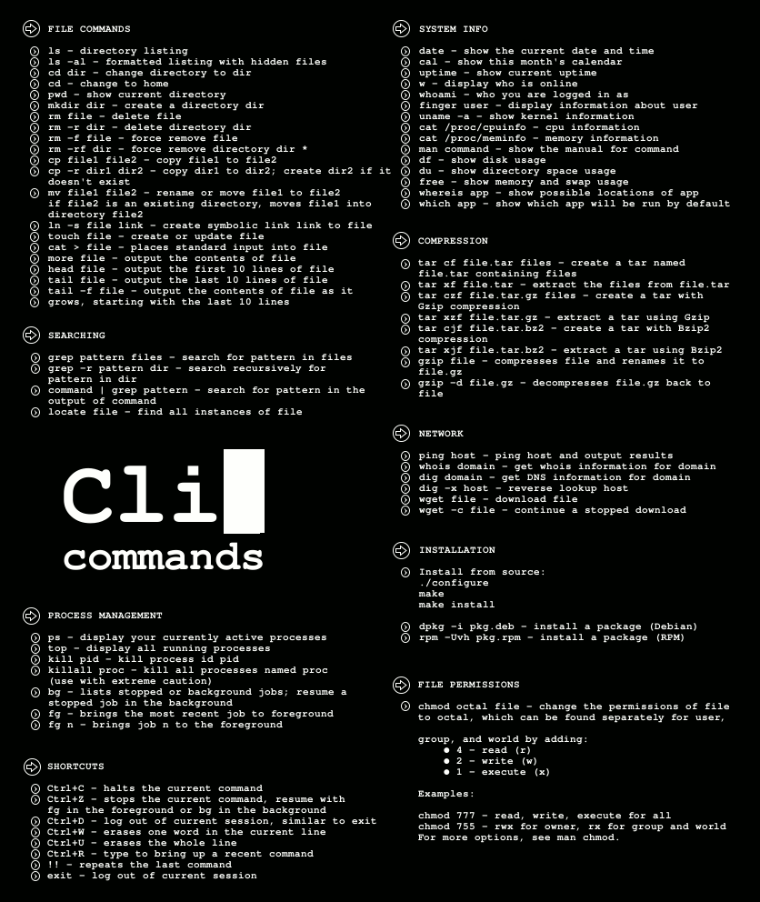

# 07.20 Shell

## 常用命令

转自 [http://www.cnblogs.com/Mainz/articles/1027168.html](http://www.cnblogs.com/Mainz/articles/1027168.html) 

[http://vimcdoc.sourceforge.net/doc/help.html](http://vimcdoc.sourceforge.net/doc/help.html)

###1 File Command
 * ls  			--文件目录列表
 * ls -al 		--包括隐藏文件的所有信息列表
 * cd dir 		--进入dir目录
 * cd  			--进入home
 * cd -  			--进入上一次目录
 * cd ..  		--进入上一级目录
 * pwd 			--查看当前目录路径
 * mkdir dir 		--创建目录
 * touch file 	--创建或更新文件
 * cat file		--打印文件
 * cat > file		--修改文件
 * more file 		--打印文件内容
 * head file 		--打印文件头部10行
 * tail file 		--打印文件尾部10行
 * tail -f file	--output the contents of file as it grows, starting with the last 10 lines
  * rm -r dir 		--删除目录
  * rm -rf dir		--force删除目录
  * rm -f file		--force删除文件
  * rm file			--删除文件
  * cp file1 file2 	--复制 file1 to file2
  * cp -r dir1 dir2 --如果dir2不存在，复制dir1 to dir2
  * cp -p file1 file2
  * mv file1 file2  --重命名或者移动file1 to file2 
  * ln -s file link --create symbolic link to file

 
###2 searching
  * grep pattern files 		--search for pattern in files 
  * grep -r pattern dir 	--search recursively for pattern in dir
  * grep -i pattern dir 	--大小写不敏感
  * set| grep pattern		--在环境变量中过滤pattern
  * command | grep pattern --search for pattern in the output of command
  * locate file				--find all instatnces of files
  * find . -name "abc"		--在目录中查找一个名称为abc的文件
  * 

###3 process management
  * ps			--显示当前运行的进程
  * top		--显示所有运行的进程
  * kill pid 	--kill process id pid
  * killall proc  --kill all process baned proc (use with extrme caution)
  * bg 		--lised stopped or background jobs, resume a stopped job in the background
  * fg 		--brings the most recent job to foreground
  * fg n 		--brings job n to the foreground 
  
 
###4 shortcuts
  * Ctrl + C  --halts the current command 停止当前命令
  * Ctrl + Z 	 --stops the current command , resume with fg in the forefround or bg in the background
  * Ctrl + D   --log out of current session, similar to exit 
  * Ctrl + W   --erases one word in the current line 清除一个单词
  * Ctrl + U   --erases the whole line  清除一整行
  * Ctrl + R   --type to bring up a recent command 在历史命令中查找
  * !!			  --repeats the last command
  * exit		  --log out of current session 退出
  * Ctrl + K	  --清屏  
  * Clear		  --清屏

###5 network
  * netstat -i	--查看网卡
  * netstat -r	--查看路由
  * netstat -tulpn           显示侦听的端口
  * netstat -anop           显示侦听的端口和侦听在这个端口号的进程
  * ping
  * alias pss='ps -ef|grep abc'	--设置快捷shell名pss，常用在.profile中
  * which pss/cc		--查cc所在目录
  * tail -f /path/to/file.log sed '/^Finished: SUCCESS$/ q' 
  当 file.log 里出现 Finished: SUCCESS 时候就退出 tail，这个命令用于实时监控并过滤 log 是否出现了某条记录。
  * ssh user@server bash < /path/to/local/script.sh 在远程机器上运行一段脚本。这条命令最大的好处就是不用把脚本拷到远程机器上。
  * lsof –i                     实时查看本机网络服务的活动状态。

###6 other
  * curl 			--repo下载时用到过curl http
  * chomd 		--修改权限
  * 

