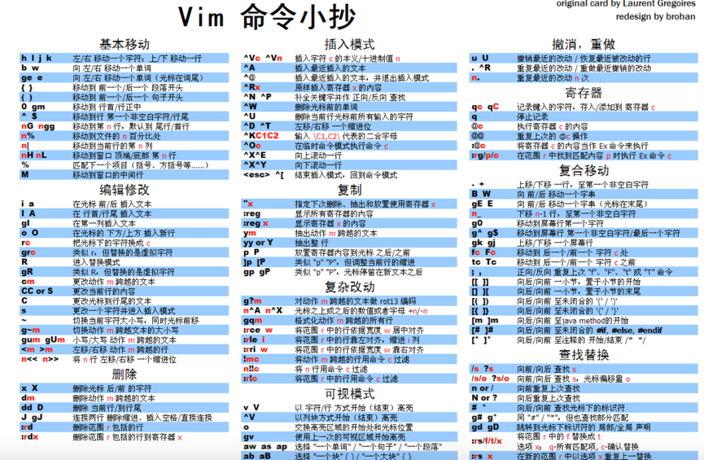
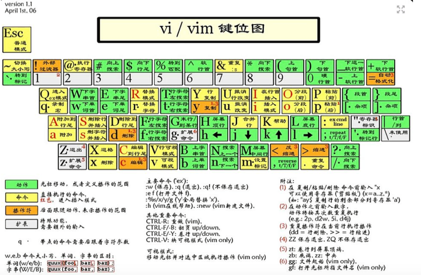

Better Stronger Faster

转自 [http://coolshell.cn/articles/5426.html](http://coolshell.cn/articles/5426.html) 

[http://vimcdoc.sourceforge.net/doc/help.html](http://vimcdoc.sourceforge.net/doc/help.html)

 

## 1 两种模式 Normal Insert
 esc 进入Normal模式
 Key —i 进入Insert模式；
 
## 2 使用 
### 第一阶段
1.	i → Insert 模式，按 ESC 回到 Normal 模式.
2.	x → 删当前光标所在的一个字符。
3.	:wq → 存盘 + 退出 (:w 存盘, :q 退出)   （陈皓注：:w 后可以跟文件名）
4.	dd → 删除当前行，并把删除的行存到剪贴板里
5.	p → 粘贴剪贴板
		(推荐:)
6.	hjkl (强例推荐使用其移动光标，但不必需) →你也可以使用光标键 (←↓↑→). 注: j 就像下箭头。
7.	:help <command> → 显示相关命令的帮助。你也可以就输入 :help 而不跟命令。（陈皓注：退出帮助需要输入:q）

### 第二阶段 
在Normal下使用 的命令
	
#### 1.	各种插入模式
	 
* a → 在光标后插入
* o → 在当前行后插入一个新行
* O → 在当前行前插入一个新行
* cw → 替换从光标所在位置后到一个单词结尾的字符
	
#### 2.	简单的移动光标
* 0 → 数字零，到行头
* ^ → 到本行第一个不是blank字符的位置（所谓blank字符就是空格，tab，换行，回车等）
* $ → 到本行行尾
* g_ → 到本行最后一个不是blank字符的位置。
* /pattern → 搜索 pattern 的字符串（陈皓注：如果搜索出多个匹配，可按n键到下一个）	
#### 3. 拷贝/粘贴 （p/P都可以，p是表示在当前位置之后，P表示在当前位置之前）
* P → 粘贴
* yy → 拷贝当前行当行于 ddP
####4. Undo/Redo
* u → undo
* <C-r> → redo
#### 5. 打开/保存/退出/改变文件(Buffer)
* :e <path/to/file> → 打开一个文件
* :w → 存盘
* :saveas <path/to/file> → 另存为 <path/to/file>
* :x， ZZ 或 :wq → 保存并退出 (:x 表示仅在需要时保存，ZZ不需要输入冒号并回车)
* :q! → 退出不保存 :qa! 强行退出所有的正在编辑的文件，就算别的文件有更改。
* :bn 和 :bp → 你可以同时打开很多文件，使用这两个命令来切换下一个或上一个文件。（使用:n到下一个文件）

